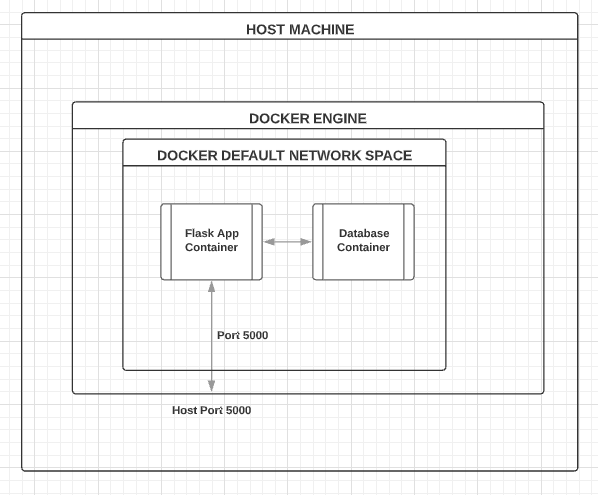

# Docker Learning Progress

This repository documents my learning journey with Docker, including commonly used commands for managing containers, data, logs, and troubleshooting.

## Building a Docker Image
To build a Docker image from a `Dockerfile`:
```sh
docker build -t <image_name>:<tag> .
```
Example:
```sh
docker build -t flask_app:1.0 .
```

## Setting Environment Variables in Docker Build
To set environment variables in a `Dockerfile`, use the `ENV` instruction:
```dockerfile
ENV APP_ENV=production
ENV DEBUG=False
```
Alternatively, you can pass environment variables at build time using `--build-arg`:
```sh
docker build --build-arg APP_ENV=production -t flask_app:1.0 .
```
To use `ARG` in a `Dockerfile`:
```dockerfile
ARG APP_ENV=development
ENV APP_ENV=$APP_ENV
```

## Creating and Managing Docker Volumes
To create a named volume:
```sh
docker volume create <volume_name>
```
To list all volumes:
```sh
docker volume ls
```
To inspect a volume:
```sh
docker volume inspect <volume_name>
```
To remove a volume:
```sh
docker volume rm <volume_name>
```

## Managing Data for Containers
To run a container with a volume mount and expose a port:
```sh
docker run -it -v <host_absolute_path>:<folder_path_in_container> -p 5000:5000 flask_app:1.0
```

## Accessing Running Containers
To get back into a running container:
```sh
docker exec -it <container_id> bash
```
If the container is running in daemon mode (background), list all running containers:
```sh
docker ps
```

## Stopping a Running Container
To stop a running container:
```sh
docker stop <container_id>
```

## Accessing Docker Logs
To view logs of a specific container:
```sh
docker logs <container_id>
```
To save logs to a file:
```sh
docker logs <container_id> > output.log
```
To watch real-time logs:
```sh
docker logs -f <container_id>
```

## Attaching to a Running Container
To attach to a running container:
```sh
docker attach <container_id>
```
⚠ **Warning:** Attaching to a container means sharing its standard input/output. If you press `Ctrl+C`, it will stop the container. To safely detach without stopping it, use `Ctrl+P + Ctrl+Q`.

## Troubleshooting
For diagnosing issues using the terminal or Docker Desktop, refer to:
[Docker Troubleshooting Guide](https://docs.docker.com/desktop/troubleshoot-and-support/troubleshoot/)

## Managing Docker Space
To check how much space Docker is using:
```sh
docker system df
```
To remove all unused data:
```sh
docker system prune
```
To clean specific elements:
```sh
docker container prune  # Remove stopped containers
docker image prune      # Remove unused images
docker network prune    # Remove unused networks
```

## Inspecting Containers
To inspect a container, image, or network:
```sh
docker inspect <container_id | image_id | network_id>
```

## Working with Docker Hub
### Pushing an Image to Docker Hub
1. Log in to Docker Hub:
   ```sh
   docker login
   ```
   Enter your Docker Hub credentials.

2. Push an image:
   ```sh
   docker push <username>/flask_app:1.0
   ```

### Pulling an Image from Docker Hub
To download an image from Docker Hub:
```sh
docker pull <username>/flask_app:1.0
```

---

This `README.md` will be updated as I progress in learning Docker. 🚀

## Docker Networks
### Network Terminologies and Commands
Some key network terminologies:
- **Hostname:** The name of a machine used to identify it in a network.
- **Ping:** Use `ping <hostname>/<ip>` to check machine connectivity.
- **Subnet:** A smaller, isolated part of a network, creating boundaries within the same network.
- **DNS:** A directory that maps reachable hosts using IP and hostname, allowing access by either.
- **/etc/hosts:** A file containing all reachable hosts with their IP addresses.

### Docker Communication


### Linking Two Networks Without Docker Compose
To link two networks manually:
```sh
docker run --link "mysql:backenddb" -p 5000:5000 flask_app:1.0
```

## Docker Compose
Docker Compose is a tool that combines and runs multiple containers of interrelated services with a single command. It defines all application dependencies in one place and allows Docker to manage them efficiently with:
```sh
docker-compose up --build
```

### Docker Compose Commands
Every command starts with `docker-compose`. Use `docker-compose --help` to see available commands.

- **Build images:**
  ```sh
  docker-compose build
  ```
  The job of the `build` command is to get the images ready to create containers. If a service is using a prebuilt image, it will skip that service.

- **List built images:**
  ```sh
  docker-compose images
  ```
  This command lists images built using the current `docker-compose` file.

- **Run a service:**
  ```sh
  docker-compose run web
  ```
  Similar to `docker run`, this creates containers from images built for services mentioned in the compose file.

- **Start containers (build if necessary):**
  ```sh
  docker-compose up
  ```
  If images are already built, it will fork the container directly. Add `--build` to force a rebuild.

- **Stop running containers:**
  ```sh
  docker-compose stop
  ```

- **Remove containers:**
  ```sh
  docker-compose rm
  ```

- **Start stopped containers:**
  ```sh
  docker-compose start
  ```

- **Restart containers:**
  ```sh
  docker-compose restart
  ```

- **List all service containers:**
  ```sh
  docker-compose ps
  ```

- **Stop and remove all services:**
  ```sh
  docker-compose down
  ```
  This command stops all services and cleans up containers, networks, and images used by the compose file.

- **View logs:**
  ```sh
  docker-compose logs
  ```
  This command is similar to `docker logs <container ID>`. The difference is that it prints logs from all services. Use `-f` to see real-time logs.

For more details, refer to the official documentation: [Docker Compose CLI Reference](https://docs.docker.com/reference/cli/docker/compose/)

