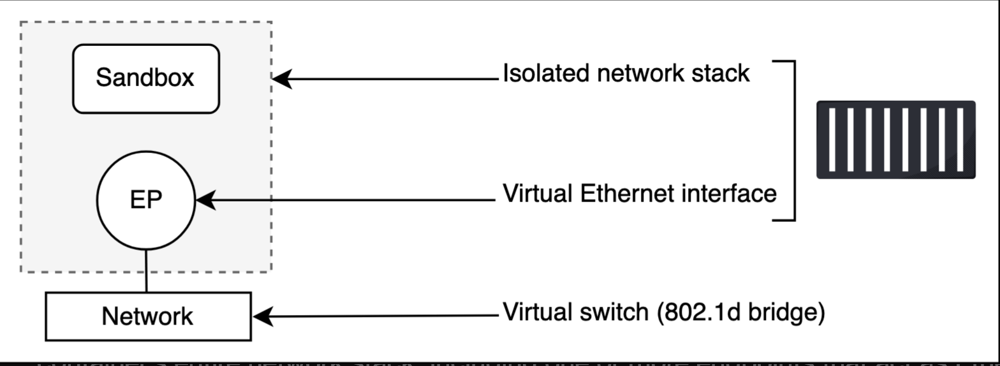
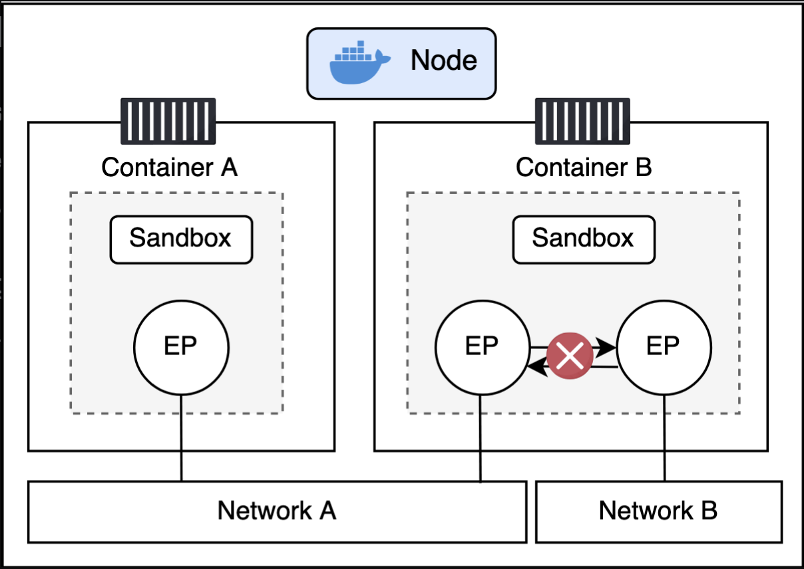
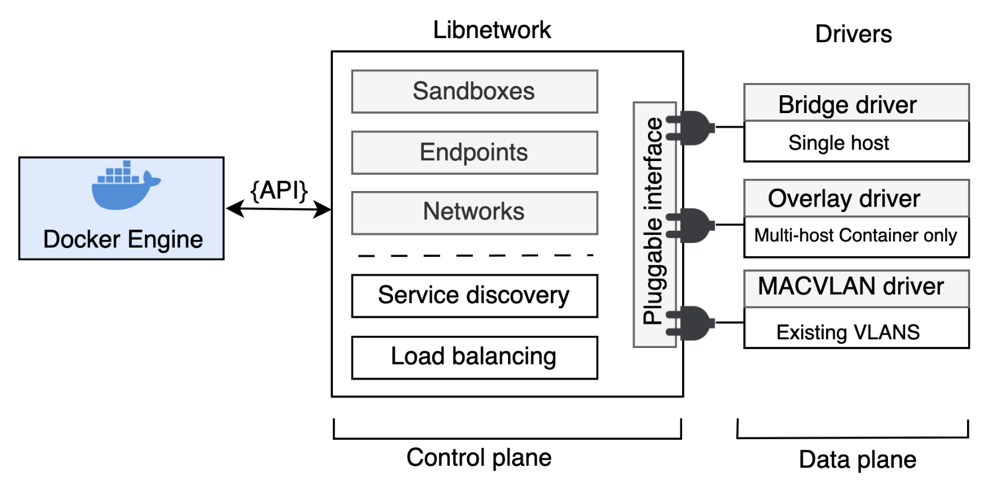

# Docker Networking

Learn how to understand Docker networking, including the Container Network Model, and libnetwork.

Docker networking is based on libnetwork, which is the reference implementation of an open-source architecture called the Container Network Model (CNM). For a smooth out-of-the-box experience, Docker ships with everything you need for the most common networking requirements, including multi-host container-to-container networks and options for plugging into existing VLANs. However, the model is pluggable, and the ecosystem can extend Docker’s networking capabilities via drivers that plug into libnetwork. Last but not least, libnetwork also provides native service discovery and basic load balancing.

# Docker Networking Theory

Let’s dive deeper into the theory of Docker networking.

At the highest level, Docker networking is based on the following three components:

- **The Container Network Model (CNM):** The CNM is the design specification and outlines the fundamental building blocks of a Docker network.
- **Libnetwork:** Libnetwork is a real-world implementation of the CNM. It’s open-sourced as part of the Moby project and used by Docker and other platforms.
- **Drivers:** Drivers extend the model by implementing specific network topologies such as VXLAN overlay networks.

The figure below shows all three:

# The Container Network Model (CNM)

Everything starts with a design. The design guide for Docker networking is the CNM that outlines the fundamental building blocks of a Docker network. I recommend you read the [specification document](https://github.com/moby/moby/blob/master/libnetwork/docs/design.md), but at a high level, it defines three building blocks:

- **Sandboxes**
- **Endpoints**
- **Networks**

A **sandbox** is an isolated network stack inside a container. It includes Ethernet interfaces, ports, routing tables, DNS configuration, and everything else you’d expect from a network stack.

**Endpoints** are virtual network interfaces that look, smell, and feel like regular network interfaces. They connect sandboxes to networks.

**Networks** are virtual switches (usually software implementations of an 802.1d bridge). As such, they group together and isolate one or more endpoints that need to communicate.

The figure below shows how all three connect and relate to familiar infrastructure components. Using CNM terminology, endpoints connect sandboxes to networks. Every container you create will have a sandbox with at least one endpoint connecting it to a network.

# Containers

As the name suggests, the Container Network Model is all about providing networking for containers. The figure below shows how CNM components relate to containers — each container gets its own sandbox which hosts the container’s entire network stack, including one or more endpoints that act as Ethernet interfaces and can be connected to networks.

Container A has a single interface (endpoint) and is only connected to Network A. However, Container B has two interfaces connected to Network A and Network B. The containers can communicate with each other because they are both connected to Network A. However, the two endpoints inside of Container B cannot communicate with each other as they’re on different networks.

# Endpoints

It’s also important to understand that endpoints behave exactly like regular network adapters, meaning you can only connect them to a single network. This is why Container B needs two endpoints if it wants to connect to both networks.

The figure below extends the diagram further by adding the Docker host. Even though both containers are running on the same host this time, their network stacks are completely isolated and can only communicate via a network.

# Libnetwork

Libnetwork is the reference implementation of the CNM. It’s open-source, cross-platform (Linux and Windows), maintained by the Moby project, and used by Docker.

## Management and Data Planes

Before Docker created libnetwork, it implemented all of its networking code inside the daemon. However, over time, the daemon became bloated and difficult for other projects to use. As a result, Docker removed the networking code from the daemon and refactored it as an external library called libnetwork based on the CNM design. Today, Docker implements all of its core networking in libnetwork.

As well as implementing the core components of the CNM, libnetwork also implements the network control plane, including management APIs, service discovery, and ingress-based container load balancing.

# Drivers

Libnetwork implements the control plane, but it relies on drivers to implement the data plane. For example, drivers are responsible for creating networks and ensuring isolation and connectivity.

Docker ships with several built-in drivers that we sometimes call native drivers or local drivers. These include bridge, overlay, and macvlan, and they build the most common network topologies. Third parties can also write network drivers to implement other network topologies and more advanced configurations.

The figure below shows the roles of libnetwork and drivers and how they relate to control plane and data plane responsibilities.

Every network you create is owned by a driver, who creates and manages everything about it. For example, if you create an overlay network called `prod-fe-cuda`, Docker will invoke the overlay driver to create the network and its resources.

To meet the demands of complex, highly fluid environments, a single Docker host or Swarm cluster can have multiple heterogeneous networks managed by different drivers.