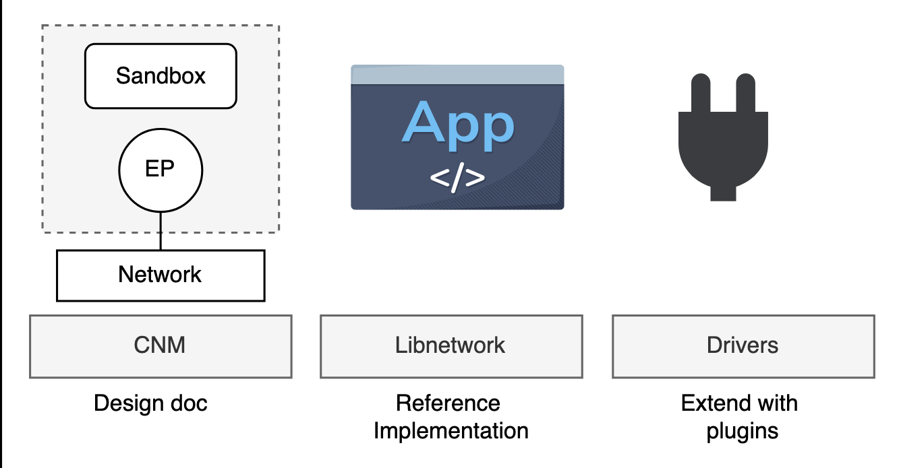

# Docker Networking

Learn how to understand Docker networking, including the Container Network Model, and libnetwork.

Docker networking is based on libnetwork, which is the reference implementation of an open-source architecture called the Container Network Model (CNM). For a smooth out-of-the-box experience, Docker ships with everything you need for the most common networking requirements, including multi-host container-to-container networks and options for plugging into existing VLANs. However, the model is pluggable, and the ecosystem can extend Docker’s networking capabilities via drivers that plug into libnetwork. Last but not least, libnetwork also provides native service discovery and basic load balancing.

# Docker Networking Theory

Let’s dive deeper into the theory of Docker networking.

At the highest level, Docker networking is based on the following three components:

- **The Container Network Model (CNM):** The CNM is the design specification and outlines the fundamental building blocks of a Docker network.
- **Libnetwork:** Libnetwork is a real-world implementation of the CNM. It’s open-sourced as part of the Moby project and used by Docker and other platforms.
- **Drivers:** Drivers extend the model by implementing specific network topologies such as VXLAN overlay networks.

The figure below shows all three:

